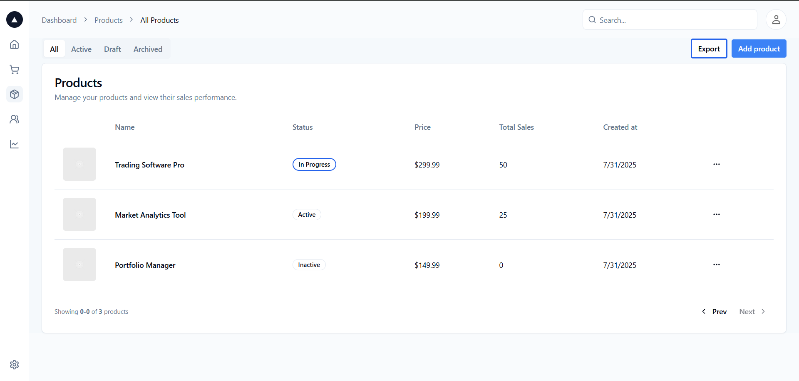

# penzack-ui

A minimal white-label UI component library for Penzack trading platform.

##  Installation

```bash
npm install penzack-ui
```

## 🚀 Quick Start

Get started quickly by importing the components. Here's an example of how the buttons and status labels are used in the dashboard:

```tsx
import { Button, StatusLabel } from 'penzack-ui';

function ProductActions() {
  return (
    <div style={{ display: 'flex', gap: '1rem', alignItems: 'center' }}>
      <StatusLabel status="in-progress" />
      <Button variant="secondary">Export</Button>
      <Button variant="primary">Add Product</Button>
    </div>
  );
}
```

## 🧱 Components

- ✅ **Button** - Primary, secondary, outline variants with loading states and full-width options
- ✅ **StatusLabel** - Labels for displaying status like 'active', 'in-progress', 'inactive', etc.

## ✨ Live Example

Here's how these components look in a real dashboard application:



In the dashboard above, the **penzack-ui components** are:
- **Buttons**: "Export" and "Add Product" buttons
- **StatusLabel**: "In Progress" status label

The rest of the dashboard interface (tables, layout, navigation) is part of the dashboard application, not the penzack-ui library.

## Development

```bash
# Install dependencies
npm install

# Start Storybook for component development
npm run dev

# Run tests
npm test

# Build package
npm run build
```

## 🎨 Customization

To customize component styling, modify the CSS files directly:

**Button Component:**
- `src/components/Button/Button.css` - Button styles and variants

**StatusLabel Component:**
- `src/components/StatusLabel/StatusLabel.css` - Status label styles and states

## 📚 Documentation

Component documentation is available in Storybook.

```bash
npm run dev  # Opens Storybook at http://localhost:6006
```

Built for trading platforms. Simple, fast, reliable.
