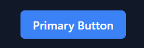
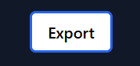

# penzack-ui

A minimal white-label UI component library for Penzack trading platform.

##  Installation

```bash
npm install penzack-ui
```

## 🚀 Quick Start

Get started quickly by importing the components. Here's an example of how the buttons and status labels are used in the dashboard:

```tsx
import { Button, StatusLabel } from 'penzack-ui';

function ProductActions() {
  return (
    <div style={{ display: 'flex', gap: '1rem', alignItems: 'center' }}>
      <StatusLabel status="in-progress" />
      <Button variant="secondary">Export</Button>
      <Button variant="primary">Add Product</Button>
    </div>
  );
}
```

## 🧱 Components

### Button
Primary, secondary, and outline variants with loading states and full-width options.





### StatusLabel  
Labels for displaying status like 'active', 'in-progress', 'inactive', etc.


## ✨ Live Example

Here's how these components look in a real dashboard application:


The dashboard above shows the `Button` and `StatusLabel` components in action - the "Export" and "Add Product" buttons, along with the "In Progress," "Active," and "Inactive" status labels are all from the `penzack-ui` library.

## 🎨 Theming

Customize the look and feel of the components by overriding the CSS custom properties.

```css
:root {
  --pz-color-primary: #your-brand-color;
  --pz-color-background: #111827;
  --pz-color-surface: #1F2937;
}
```

## 🛠️ Development

```bash
# Install dependencies
npm install

# Start Storybook for component development
npm run dev

# Run tests
npm test

# Build package
npm run build
```

## 📚 Documentation

Component documentation is available in Storybook.

```bash
npm run dev  # Opens Storybook at http://localhost:6006
```

Built for trading platforms. Simple, fast, reliable.
